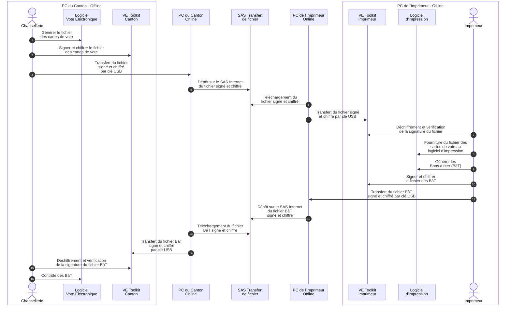

# Chiffrement et signature des fichiers imprimeur

## Description du processus métier

Le processus de transmission des fichiers permettant l'impression des cartes de vote électronique est régi par l'[Ordonnance de la ChF
sur le vote électronique](https://www.fedlex.admin.ch/eli/cc/2022/336/fr) et en particulier le [chapitre 7 de son annexe](https://www.fedlex.admin.ch/eli/cc/2022/336/fr#annex_u1/lvl_u1/lvl_7).

## Concept

Un service en ligne chiffré, authentifié et tracé, fourni par le canton de Genève permet:
- au canton d'envoyer les fichiers d'impression des cartes de vote électronique à l'imprimeur;
- à l'imprimeur d'envoyer les bons à tirer au canton.

Etant donné la criticité de ces fichiers qui contiennent les codes d'initialisation, de vérification et de confirmation
pour le vote électronique, il est cependant nécessaire d'assurer à ces fichiers leur intégrité, leur authenticité et leur 
confidentialité indépendamment du canal de communication.

Pour cela, ils sont signés avec le certificat de l'émetteur et chiffrés en mode authentifié avec le certificat public du destinataire (principe sign-then-AEAD).

Au niveau de l'implémentation, nous utilisons OpenSSL avec le standard CMS (Cryptographic Message Syntax):

- Signature du message à l'aide de l'algorithme `RSA-PSS` avec une clé privée de 3072 bits et l'algorithme de hash `SHA256`.
- Chiffrement authentifié du message signé à l'aide de `AES-256-GCM`, la clé symétrique générée étant wrappée par la clé publique du destinataire en utilisant `AES-256-wrap`.

## Structure du repository

Le répertoire de base `transmission-signee-chiffree` contient des scripts permettant l'exécution des différentes étapes de
préparation et de transmission avec des valeurs de paramètre pré-déterminés.

Le répertoire `bin` contient les scripts OpenSSL de base permettant d'exécuter les différentes actions à l'aide de
paramètres.

Le répertoire `tests` contient le script `run-tests.ps1` permettant de tester l'ensemble des fonctionnalités du processus.

## Prérequis

### OpenSSL

Le logiciel OpenSSL doit être installé et disponible dans le PATH. Il faut utiliser une version récente supportant `AES-256-GCM`. Pour vérifier, exécuter `openssl list -cipher-algorithms` et rechercher si `AES-256-GCM` apparaît dans les résultats.

## Etapes du processus de transmission

### Préparation des certificats de signature et de chiffrement

Les certificats suivants doivent être générés:

- Un certificat permettant à la Chancellerie de signer les fichiers à destination de l'imprimeur.
- Un certificat permettant à la Chancellerie de recevoir des fichiers chiffrés à son intention par l'imprimeur.
- Un certificat permettant à l'imprimeur de signer les fichiers qu'il envoie à la Chancellerie.
- Un certificat permettant à l'imprimeur de recevoir des fichiers chiffrés à son intention par la Chancellerie.

Ces certificats sont créés à l'aide des deux scripts:

- `01-generer-certificat-GE.ps1`
- `02-generer-certificats-Imprimeur.ps1`

Enfin, les empreintes des certificats sont obtenus à l'aide du script suivant:

- `03-lister-empreintes-certificats.ps1`

### Envoi d'un fichier à l'imprimeur

La commande suivante permet au canton de signer et chiffrer un fichier à envoyer à l'imprimeur:

`04-envoi-GE-Imprimeur.ps1 <chemin vers le fichier à envoyer>`

### Réception du fichier par l'imprimeur

La commande suivante permet à l'imprimeur de déchiffrer le fichier reçu et de vérifier sa signature:

`05-reception-Imprimeur.ps1 <chemin vers le fichier reçu>`

### Envoi d'un fichier au canton

La commande suivante permet à l'imprimeur de signer et chiffrer un fichier à envoyer au canton:

`06-envoi-Imprimeur-GE.ps1 <chemin vers le fichier à envoyer>`

### Réception du fichier par le canton

La commande suivante permet au canton de déchiffrer le fichier reçu et de vérifier sa signature:

`07-reception-GE.ps1 <chemin vers le fichier reçu>`

## Test

Un test complet de la transmission dans les deux sens peut être exécuté en lançant la commande suivante depuis 
le répertoire `transmission-signee-chiffree`:

`.\tests\run-test.ps1`